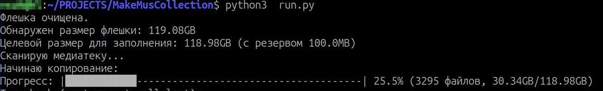

# 🎵 Flash Drive Music Filler

**Автоматическое заполнение флешки случайными аудиофайлами**  
Скрипт для создания уникальных музыкальных коллекций на съемных носителях с каждой новой генерацией.



## 🔥 Ключевые особенности

- **Автоопределение размера** - заполняет до 99% пространства любой флешки
- **Умное исключение повторов** - минимизирует дубли между поколениями коллекций
- **Параллельное копирование** - 3 потока для максимальной скорости
- **Интерактивный прогресс-бар** - визуализация процесса в реальном времени
- **Подробная аналитика** - сравнение фактического и расчетного использования
- **Защита от ошибок** - резерв 100MB + обработка исключений
- **Гибкая конфигурация** - поддержка любых размеров носителей

## ⚙️ Технические требования

- **Python**: 3.6 или новее
- **ОС**: Linux (тестировалось на Ubuntu 20.04+)
- **Точки монтирования**:
  - Флешка: `/mnt/CD`
  - Медиатека: `/mnt/hdd/FILES/Music`

## 🚀 Быстрый старт

```bash
# Скачать скрипт
wget https://raw.githubusercontent.com/yourrepo/flash-filler/main/fill_flash.py

# Дать права на выполнение
chmod +x fill_flash.py

# Запуск для флешки 36GB
./fill_flash.py

# Запуск для любой флешки
./fill_flash.py --skip-size-check
```

## Тестирование

Покрыты тестами ключевые функции: `get_unique_filename`, `clear_flash_drive`, `calculate_real_usage`, `verify_flash_capacity`, тесты для `get_unique_filename` с и без включенной настройки RANDOMIZE.
Для запуска тестов требуется библиотека `pytest`:

```bash
python -m pytest tests/
```

## 📜 Лицензия

MIT License. Полный текст доступен в файле [LICENSE](LICENSE).

---

## Пример файла .env

```dotenv
# Пример файла .env для Flash Drive Music Filler
# Скопируйте этот файл в .env и настройте под свои нужды

# Путь к флешке (точка монтирования)
FLASH_DRIVE=/mnt/CD

# Путь к музыкальной медиатеке
MUSIC_LIBRARY=/mnt/hdd/FILES/Music

# Файл для хранения истории скопированных файлов
HISTORY_FILE=~/.flash_music_history

# Ожидаемый размер флешки в гигабайтах (целое число)
EXPECTED_SIZE_GB=36

# Допустимое отклонение размера флешки (доля, например 0.02 = 2%)
ALLOWED_CAPACITY_DEVIATION=0.02

# Резервируемое место на флешке в байтах (например, 100MB)
RESERVE_SIZE=104857600

# Количество потоков для копирования
THREAD_COUNT=3

# Какие расширения файлов копировать (через запятую, без пробелов)
# В коде поддерживаются только .mp3 и .mp4, пример: '.mp3,.mp4'
# EXTENSIONS='.mp3,.mp4'

# Добавлять к каждому файлу случайный префикс вида [NNNN]_ (True/False)
# Используется для тупых плееров, которые не умеют в случайное воспроизведение
RANDOMIZE=False